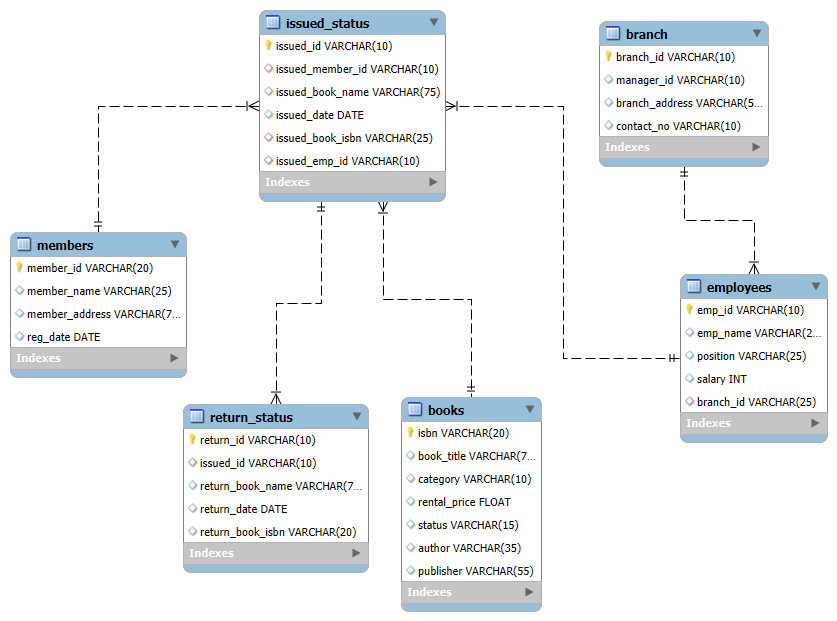

# Library Management System (MySQL Project)

This is a comprehensive Library Management System database project built with MySQL. It includes a complete database schema, sample data (from CSVs), and a set of advanced queries to demonstrate data retrieval and analysis.

This project is designed to manage books, members, branches, employees, and the full lifecycle of borrowing (issuing and returning) books.

## Database Schema (ERD)

The database follows a relational model to efficiently manage the library's operations. The Entity-Relationship Diagram (ERD) visualizes the tables, their columns, and the relationships between them.

*(You can also open the `ERD/ERD.mwb` file in MySQL Workbench to explore the model interactively.)*

---

## How to Use This Project

You can recreate this database on your local machine by following these steps.

**Prerequisites:**
* A running MySQL server
* A MySQL client (like MySQL Workbench, DBeaver, or the command line)

### 1. Create the Database & Tables

First, you need to create the database schema.

* Run the script in `sql_queries/ProjectTasks.sql` (or whichever file contains your `CREATE TABLE` statements) to build the database structure.

### 2. Load the Data

There are two ways to load the data:

**Method A: Using the SQL Insertions (Recommended)**
* Run the script in `sql_queries/ProjectDataEntries.sql` to populate all the tables with the sample data.

**Method B: Using the CSVs**
* Alternatively, you can use the CSV files in the `data/` folder to import data into your tables. This is often done using the `LOAD DATA INFILE` command in MySQL or the table data import wizard in MySQL Workbench.

### 3. Run Sample Queries

Once the database is set up and populated, you can run the advanced queries to see the system in action.
* Open and run the queries in `sql_queries/AdvanceSqlQueries.sql` to see examples of joins, subqueries, and other operations.

---

## File Structure

* `/data/` - Contains all the raw `.csv` data files used to populate the database.
* `/ERD/` - Contains the MySQL Workbench model (`.mwb`) and a viewable image (`.png`) of the database schema.
* `/sql_queries/` - Contains all the `.sql` scripts, separated by function:
    * `ProjectTasks.sql`: Schema creation (tables, relationships).
    * `ProjectDataEntries.sql`: Data insertion (SQL `INSERT` statements).
    * `AdvanceSqlQueries.sql`: Example queries for analysis and reporting.
* `.gitignore`: Specifies files for Git to ignore.
* `LICENSE`: The MIT License, detailing how this project can be used.
* `README.md`: This file.
